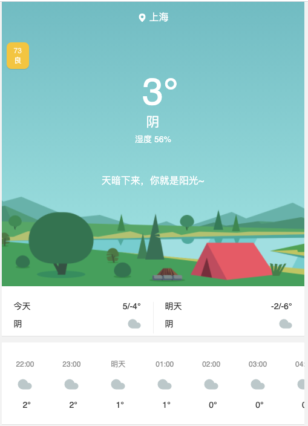
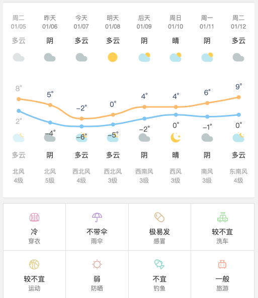

## react腾讯天气组件

 [](https://www.npmjs.com/package/react-tencent-weather) [](https://www.npmjs.com/package/react-tencent-weather) [](https://www.npmjs.com/package/react-tencent-weather)  

体验地址:

[https://www.douyacun.com](https://www.douyacun.com)

文档：

[http://douyacun.io/article/b9093956c565e471f45c035b5870ed0c](http://douyacun.io/article/b9093956c565e471f45c035b5870ed0c)

特点：

1. 使用腾讯天气接口: `https://wis.qq.com/weather/common?source=pc&weather_type=forecast_1h|forecast_24h|alarm|limit|tips|rise|observe|index&province=${province}&city=${city}&county=`
2. 支持：逐小时预报/7日天气预报/生活指数
3. 支持IP定位，使用[免费IP定位接口](https://www.douyacun.com/article/a57b58a343f051cf1fb9761a31d37693)
4. 支持服务端渲染





## install

```bash
npm install tencent_weather --save
```

运行demo:

```bash
git clone git@github.com:hustcc/echarts-for-react.git

npm install

npm start
```

本地浏览器打开 [http://127.0.0.1:3000](http://127.0.0.1:3000)

## usage

客户端使用

```react
import React from 'react';
import ReactDOM from 'react-dom';
import Weather from 'react-tencent-weather';

ReactDOM.render(
    <div><Weather province="上海" city="上海" /></div>,
    document.getElementById('root')
)
```

服务端渲染

```react
import React from 'react';
import ReactDOM from 'react-dom';
import Weather from 'react-tencent-weather/lib/ssr/index.js';
import 'react-tencent-weather/lib/ssr/index.css';

ReactDOM.render(
    <div><Weather province="上海" city="上海" /></div>,
    document.getElementById('root')
)
```


## component props

- `province`: (optional, string)

省份，默认上海

- `city`: (optional, string)

城市，默认上海

- `showDays` : (optional, bool)

是否显示 7日天气预报

- `showHours`: (optional, bool)

是否显示 逐小时预报

- `showLiving`: (optional, bool)

是否显示 生活指数

- `showTomorrow`:  (optional, bool)

是否显示明日预报


# LICENSE

MIT@[douyacun](https://github.com/douyacun).

关注微信公众号

